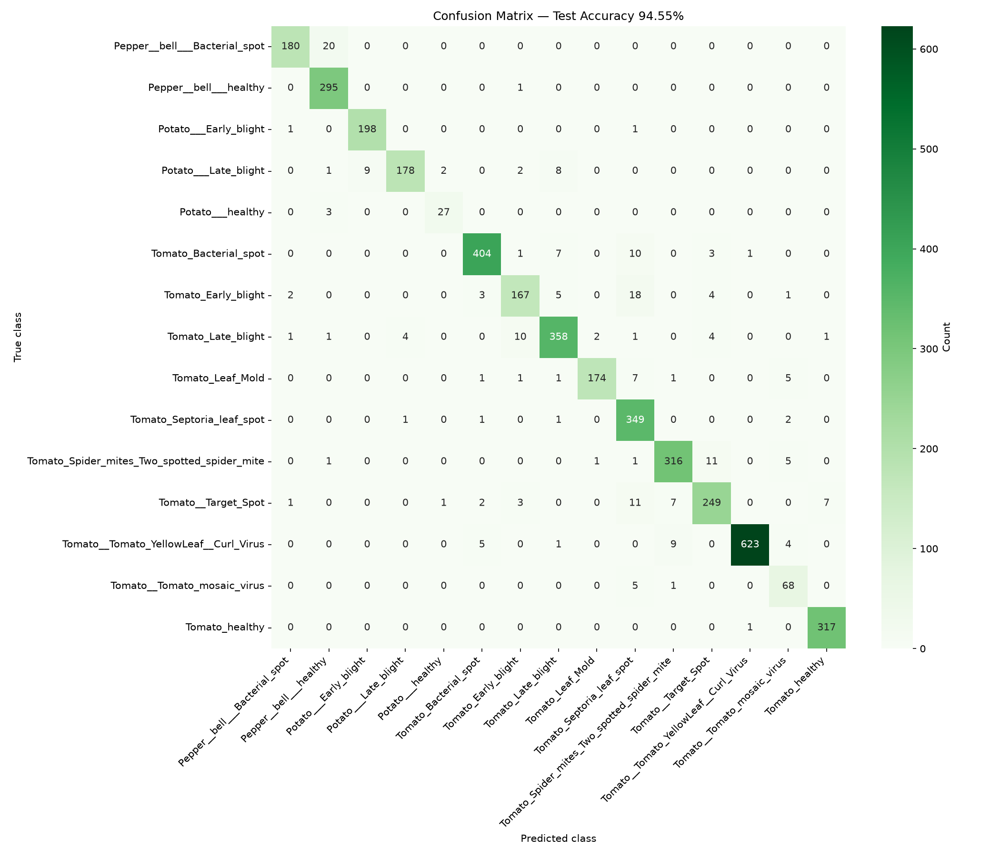
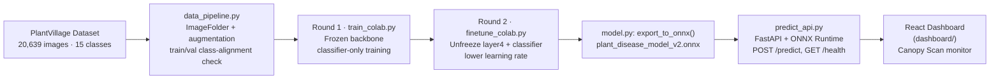
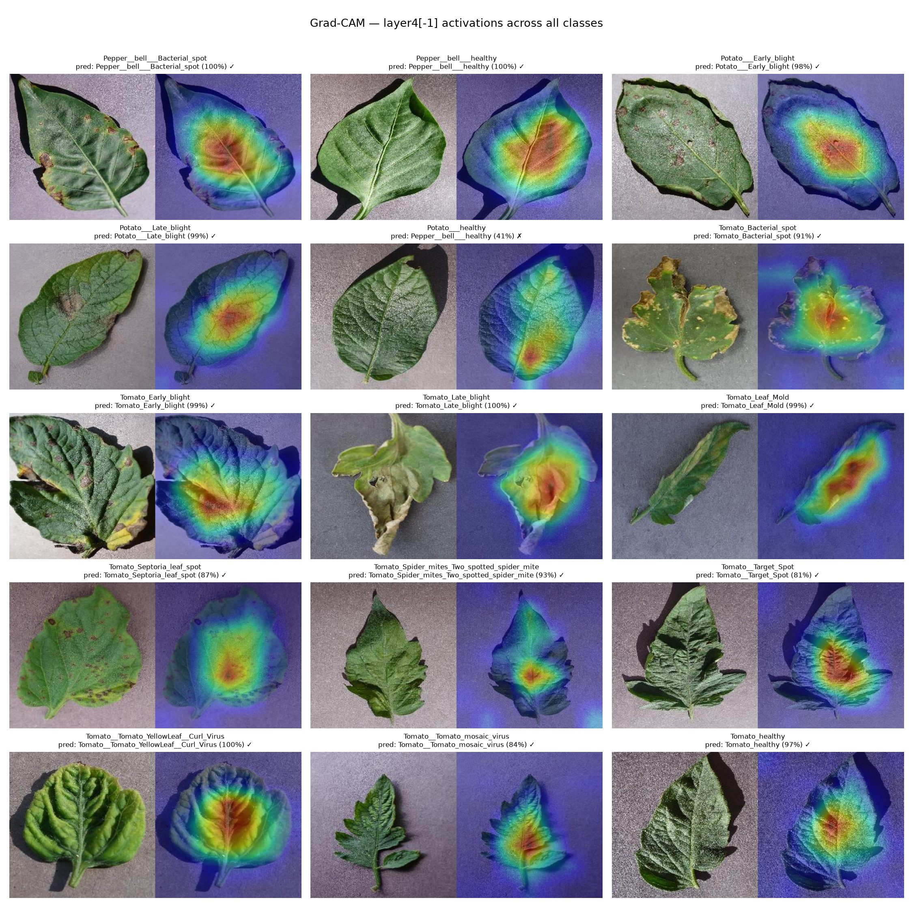
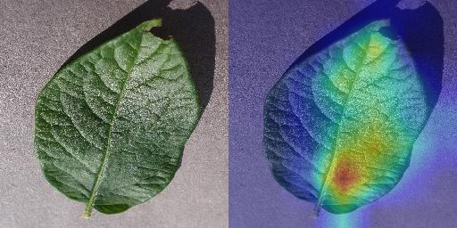
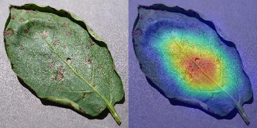
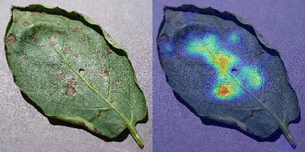

# 🌿 Plant Disease Detection

**A ResNet50 transfer-learning model, served over a REST API and monitored through a
custom-built React dashboard — trained to spot 15 crop/disease combinations across
Pepper, Potato, and Tomato leaves.**


---

## 1. Project Overview

Late detection is the core cost of plant disease in intensive growing operations: by the
time a lesion is visible enough for a human to catch on a routine walk-through, the
pathogen has often already spread to neighboring plants. This project trains a computer
vision model to catch that signal earlier and more consistently — a leaf photo goes in,
and a disease classification with a calibrated confidence score comes out in ~50ms,
fast enough to sit in a real-time inspection loop for a vertical farm or greenhouse
camera system rather than a batch offline job.

The project covers the full path from raw dataset to a usable tool: a validated data
pipeline, a two-stage transfer-learning training run, export to ONNX for lightweight
CPU inference, a FastAPI backend that serves that model, and a purpose-built React
dashboard that calls the live API and gives an operator a scanner-style interface to
review results.

**What this demonstrates:**
- Transfer learning with a pretrained CNN (ResNet50 / ImageNet) adapted to a
  domain-specific 15-class vision task
- A staged fine-tuning strategy — frozen backbone, then selective unfreezing — to
  balance data efficiency against catastrophic forgetting
- Model export to ONNX for framework-agnostic, low-latency CPU inference
- REST API design (FastAPI) with an explicit, typed request/response contract
- Grad-CAM explainability to verify the model attends to lesion regions, not
  background artifacts
- End-to-end product thinking: a real front-end consuming the live model, not just a
  notebook — including its own resilience (timeouts, retries, offline detection) and
  a deliberate design system
- Reproducible experimentation: deterministic seeding, MLflow experiment tracking,
  and an explicit train/val class-alignment check in the data pipeline

---

## 2. Dataset

The model is trained on a **PlantVillage-style dataset**: 15 crop/condition classes
across Pepper (Bell), Potato, and Tomato, split into `data/train`, `data/val`, and
`data/test` (standard `torchvision.ImageFolder` layout — one subfolder per class).

| Class (folder name) | Crop | Condition | Train | Val | Test |
|---|---|---|--:|--:|--:|
| `Pepper__bell___Bacterial_spot` | Pepper (Bell) | Bacterial Spot | 697 | 100 | 200 |
| `Pepper__bell___healthy` | Pepper (Bell) | Healthy | 1,034 | 148 | 296 |
| `Potato___Early_blight` | Potato | Early Blight | 699 | 101 | 200 |
| `Potato___Late_blight` | Potato | Late Blight | 699 | 101 | 200 |
| `Potato___healthy` | Potato | Healthy | 106 | 16 | 30 |
| `Tomato_Bacterial_spot` | Tomato | Bacterial Spot | 1,488 | 213 | 426 |
| `Tomato_Early_blight` | Tomato | Early Blight | 699 | 101 | 200 |
| `Tomato_Late_blight` | Tomato | Late Blight | 1,336 | 191 | 382 |
| `Tomato_Leaf_Mold` | Tomato | Leaf Mold | 666 | 96 | 190 |
| `Tomato_Septoria_leaf_spot` | Tomato | Septoria Leaf Spot | 1,239 | 178 | 354 |
| `Tomato_Spider_mites_Two_spotted_spider_mite` | Tomato | Two-Spotted Spider Mite | 1,173 | 168 | 335 |
| `Tomato__Target_Spot` | Tomato | Target Spot | 982 | 141 | 281 |
| `Tomato__Tomato_YellowLeaf__Curl_Virus` | Tomato | Yellow Leaf Curl Virus | 2,246 | 321 | 642 |
| `Tomato__Tomato_mosaic_virus` | Tomato | Mosaic Virus | 261 | 38 | 74 |
| `Tomato_healthy` | Tomato | Healthy | 1,113 | 160 | 318 |
| **Total** | | | **14,438** | **2,073** | **4,128** |

That's **20,639 images** across the three splits. Note the class imbalance visible in
the table — `Potato___healthy` has only 106 training images versus 2,246 for
`Tomato__Tomato_YellowLeaf__Curl_Virus`, over a 20x spread. This is addressed at
training time with augmentation (random flips, rotation, color jitter) on the
minority-heavy classes but not with explicit class weighting; see
[Limitations](#12-limitations--future-work).

**A note on realism:** PlantVillage images are captured in controlled studio
conditions — a single leaf, plain uniform background, consistent lighting, no
occlusion or clutter. That's ideal for training a clean classifier, but it's not what
a camera mounted in an actual greenhouse or vertical-farm rack sees (variable
lighting, multiple overlapping leaves, dirt/equipment in frame, motion blur). This
matters for interpreting the results below — see
[Limitations](#12-limitations--future-work) for what closing that gap would take.

---

## 3. Architecture & Approach

The model is a **ResNet50** (`torchvision.models.resnet50`, `ResNet50_Weights.IMAGENET1K_V2`)
with its final fully-connected layer replaced by a `Dropout(0.5) → Linear(2048, 15)`
head ([`model.py`](model.py)).

Training happened in **two stages**, run on a Colab GPU runtime
(`train_colab.py`, `finetune_colab.py`):

**Round 1 — frozen backbone, classifier-only.** Every ResNet50 backbone weight stays
frozen at its ImageNet-pretrained value; only the newly-initialized classifier head is
trained. With ~14K training images spread across 15 classes, updating all 23M+
backbone parameters from a cold, randomly-initialized head would risk overwriting the
general-purpose visual features (edges, textures, color/shape priors) that ImageNet
pretraining already provides, and would be far more prone to overfitting on a dataset
this size. Freezing the backbone turns training into fitting a lightweight linear
classifier on top of fixed, general-purpose features — fast, cheap, and
data-efficient.

**Round 2 — fine-tuning, `layer4` + classifier unfrozen.** Starting from the Round 1
checkpoint, the final residual block (`layer4`) is unfrozen alongside the classifier
head, and training continues at a **lower learning rate**. This lets the
highest-level backbone features specialize toward leaf textures and lesion patterns
specifically — rather than staying tuned to generic ImageNet categories — while the
reduced learning rate keeps each update small enough to avoid catastrophic
forgetting of what Round 1 already learned, or destabilizing the still-frozen
earlier layers. Only unfreezing the last block (not the whole network) keeps that
risk low while still giving the model room to close the gap that frozen features
couldn't reach on their own.

This staged approach is a standard transfer-learning pattern precisely because it's
data-efficient: it gets most of the benefit of full fine-tuning without needing a
dataset anywhere near ImageNet's scale to avoid destroying the pretrained
representation in the process.

---

## 4. Results

| Stage | Trainable layers | Final Val Accuracy |
|---|---|--:|
| Round 1 (`train_colab.py`) | Classifier head only — backbone frozen | **76.99%** |
| Round 2 (`finetune_colab.py`) | `layer4` + classifier head, lower LR | **94.40%** |
| **Improvement** | | **+17.41 points** |

Round 1 plateaus in the high-70s: a linear classifier on top of frozen ImageNet
features can already separate crops and coarse disease patterns reasonably well, but
generic pretrained features aren't sharp enough to reliably tell apart diseases that
present as visually similar leaf-surface lesions — Tomato Early Blight, Late Blight,
and Septoria Leaf Spot are the obvious confusable trio in this class list. Unfreezing
`layer4` in Round 2 lets the deepest convolutional features adapt directly to
leaf-lesion textures instead of generic object categories, and validation accuracy
jumps to 94.40% — a 17.41-point gain from that one architectural change, with no
change to the dataset.

**Inference speed:** the Round 2 checkpoint is exported to ONNX
(`models/plant_disease_model_v2.onnx`) and served through ONNX Runtime's CPU
execution provider. End-to-end inference — image decode, resize, normalize, forward
pass — averages **~50ms per image on CPU**, measured live through the `/predict`
endpoint the dashboard calls. That's fast enough for interactive, per-image review
rather than a batch job.

### Test Set Evaluation

Full evaluation on the held-out test set (4,128 images, via `evaluate_model.py`)
confirms the model generalizes consistently: **94.55% test accuracy**, closely
matching the 94.40% validation accuracy reached during fine-tuning.



Per-class analysis shows the model's errors cluster around diseases that are
visually similar even to trained observers, rather than random or systematic
failures:
- Tomato Early Blight ↔ Septoria Leaf Spot — both produce dark, irregular leaf
  lesions and are a documented source of visual ambiguity in tomato disease
  identification
- Target Spot ↔ Septoria Leaf Spot ↔ Spider Mite damage — similarly overlapping
  visual symptoms

The one pattern worth flagging: Pepper Bacterial Spot vs. Pepper healthy (20
misclassifications) is the model's most safety-relevant confusion, since
distinguishing disease from health matters more than distinguishing between two
diseases. This suggests early-stage/subtle presentations of bacterial spot are
the model's primary weak point — a natural target for future data augmentation
or targeted fine-tuning.

Per-class precision/recall/F1 and the full misclassification breakdown are in
[`docs/evaluation_report.txt`](docs/evaluation_report.txt); reproduce with
`python evaluate_model.py`.

---

## 5. System Architecture / Pipeline



| Stage | Role |
|---|---|
| **Dataset** | 15-class PlantVillage-style leaf images, pre-split into train/val/test folders |
| **Data Pipeline** (`data_pipeline.py`) | `ImageFolder` loading, ImageNet-normalized augmentation for training, a validation-only transform, and a hard check that train/val expose the same class set before training can silently misalign label indices |
| **Round 1 Training** (`train_colab.py`) | Frozen-backbone classifier training on a Colab GPU runtime |
| **Round 2 Fine-Tuning** (`finetune_colab.py`) | Unfreezes `layer4` + classifier, continues at a lower LR |
| **ONNX Export** (`model.py`) | Converts the best PyTorch checkpoint to ONNX with class names/image size embedded as model metadata, so `predict.py`/`predict_api.py` don't need a side-car config file |
| **FastAPI Backend** (`predict_api.py`) | Loads the ONNX model once at startup, exposes `POST /predict` and `GET /health` |
| **React Dashboard** (`dashboard/`) | Calls the live API, renders the prediction, confidence breakdown, and session history |

*(Local `train.py` is a separate, single-stage sanity-check script — it trains the
full network end-to-end on a small subset to verify the pipeline works before
committing to a full Colab GPU run; it isn't what produced the Round 1/2 numbers
above.)*

---

## 6. Tech Stack

| Layer | Technology |
|---|---|
| **Model training** | PyTorch 2.13 · torchvision 0.28 (ResNet50, `ImageNet1K_V2` weights) |
| **Experiment tracking** | MLflow 3.15 (params, per-epoch metrics, artifacts) |
| **Evaluation / viz** | scikit-learn 1.9 (confusion matrix) · matplotlib 3.11 · seaborn 0.13 |
| **Explainability** | Custom Grad-CAM (`predict.py`) via forward/backward hooks on `layer4` |
| **Model export & inference** | ONNX 1.22 · ONNX Runtime 1.29 (CPUExecutionProvider) |
| **Backend API** | FastAPI 0.141 · Uvicorn 0.52 · python-multipart (file uploads) |
| **Image processing** | Pillow 12.3 · NumPy 2.5 |
| **Frontend** | React 18.3 · Vite 5.4 |
| **Styling** | Tailwind CSS 3.4 with a fully custom theme (no default palette/fonts) |
| **Frontend tooling** | ESLint 8.57 · Vitest 2.1 (unit tests) |

---

## 7. Project Structure

```
plant-disease-detection/
├── data/                      # train/ val/ test/ — ImageFolder layout, 15 class folders each
├── models/
│   ├── plant_disease_model_v2.onnx(.data)   # served by predict_api.py — Round 2 fine-tuned
│   ├── plant_disease_model.onnx(.data)      # Round 1 export
│   └── resnet50_v1.pt / resnet50_v1.onnx    # PyTorch checkpoint (used for Grad-CAM)
├── outputs/                   # training curves, confusion matrix, class distribution, Grad-CAM overlays
├── mlruns/                    # MLflow tracking store
│
├── data_pipeline.py           # ImageFolder + augmentation + train/val validation
├── model.py                   # build/save/load model, ONNX export
├── train.py                   # local single-stage sanity-check trainer
├── train_colab.py             # Round 1: frozen-backbone training (Colab GPU)
├── finetune_colab.py          # Round 2: layer4 fine-tuning (Colab GPU)
├── predict.py                 # CLI single-image inference + Grad-CAM heatmap
├── predict_api.py             # FastAPI serving layer (POST /predict, GET /health)
│
└── dashboard/                 # React + Vite + Tailwind monitoring UI
    ├── src/
    │   ├── App.jsx                    # state, health polling, request lifecycle
    │   ├── api.js                     # typed fetch client for predict_api.py
    │   ├── components/
    │   │   ├── UploadPanel.jsx        # drag-and-drop / click-to-browse + validation
    │   │   ├── ScannerOverlay.jsx     # animated scan-line + reticle loading state
    │   │   ├── ResultCard.jsx         # prediction, confidence, status badges
    │   │   ├── ConfidenceBars.jsx     # sorted 15-class probability breakdown
    │   │   ├── HistoryTable.jsx       # session scan log
    │   │   ├── StatusBadges.jsx       # independent disease/confidence badges
    │   │   └── ErrorBoundary.jsx
    │   └── utils/                     # class-name parsing, image validation/thumbnailing
    └── tailwind.config.js             # custom palette, type scale, scan-line keyframes
```

---

## 8. Getting Started

### Backend (training + API)

```bash
python -m venv venv
venv\Scripts\activate          # Windows; use `source venv/bin/activate` on macOS/Linux

pip install torch torchvision fastapi uvicorn onnx onnxruntime mlflow \
            scikit-learn seaborn matplotlib pillow numpy tqdm python-multipart

# Inspect the dataset: class counts, a distribution chart, sample augmentations
python data_pipeline.py --data-dir data

# Local sanity-check training run (small, single-stage — see note in section 5)
python train.py --epochs 5 --max-train-samples 500

# Serve the Round 2 fine-tuned model
uvicorn predict_api:app --reload
# → http://127.0.0.1:8000  (interactive docs at /docs)
```

> The full two-stage training run (`train_colab.py` → `finetune_colab.py`) targets a
> Colab GPU runtime, not this local setup — `train.py` here is only for verifying the
> data pipeline end-to-end.

### Dashboard

```bash
cd dashboard
npm install
npm run dev
# → http://localhost:5173, expects the API at http://127.0.0.1:8000
# (override with VITE_API_BASE_URL — see .env.example)
```

> `data/` (~380MB) and the trained model weights (~94MB each) are large binary
> artifacts and are excluded via `.gitignore` — they're not in this repository.
> Obtain the PlantVillage dataset separately and place it under `data/`, then
> either train locally with `train.py` or re-export a checkpoint to
> `models/plant_disease_model_v2.onnx` before running the API.

---

## 9. API Reference

| Method | Path | Description |
|---|---|---|
| `GET` | `/` | Liveness check + whether the ONNX model loaded successfully at startup |
| `GET` | `/health` | `{ "status": "ok", "model_loaded": bool }` — polled by the dashboard every 15s |
| `POST` | `/predict` | `multipart/form-data`, field `file` (image) → prediction |

**Request**

```bash
curl -X POST http://127.0.0.1:8000/predict -F "file=@leaf.jpg"
```

**Response** — `PredictionResponse` (see `predict_api.py`):

```json
{
  "predicted_class": "Tomato_Late_blight",
  "confidence": 0.998,
  "inference_time_ms": 52.7,
  "all_class_probabilities": {
    "Tomato_Late_blight": 0.998,
    "Tomato_healthy": 0.001,
    "Tomato_Early_blight": 0.0004
  }
}
```

`all_class_probabilities` includes all 15 classes (truncated above for brevity).
`predicted_class` is always one of the 15 raw folder-name strings listed in
[section 2](#2-dataset).

---

## 10. Monitoring Dashboard

A purpose-built React dashboard ("Canopy Scan") replaces the generic-SaaS look with a
scanner/inspection-equipment aesthetic suited to a vertical-farm context — a deep
forest palette (`#0F1F17`/`#16261D`), leaf-green and warm-rust accents
(`#6FCF97`/`#E8734A`), and a Fraunces/Inter/JetBrains Mono type system, all defined
as custom Tailwind theme tokens rather than the framework defaults.

**Features:**
- Drag-and-drop or click-to-browse upload, with client-side type/size validation
- A custom scan-line + corner-reticle sweep animation over the image while inference
  runs (respects `prefers-reduced-motion`)
- **Two independent status badges** per result — *Disease Status* (`Healthy` /
  `Disease Detected`, from `predicted_class` alone) and *Confidence Status*
  (`Confident` / `Needs Review`, from the confidence score alone, threshold 70%) — so
  a confident diagnosis and an uncertain-but-healthy read are visually distinct
- A sorted probability bar list across all 15 classes
- A session history table (thumbnail, class, confidence, both status badges, time)
- Resilience: request timeout + explicit cancel, retry-on-error, live `/health`
  polling to detect an unreachable API or an unloaded model, and a React error
  boundary so a render crash doesn't blank the page

---

## 11. Explainability

`predict.py` includes a Grad-CAM implementation (forward/backward hooks on
`layer4`) that overlays a heatmap on the input image showing which regions drove the
prediction — a basic but important sanity check that the model is keying on the leaf
lesion itself rather than incidental background or lighting artifacts. It only runs
against the PyTorch `.pt` checkpoint, since Grad-CAM needs backprop through the
network and a plain ONNX Runtime session doesn't expose that (`predict.py` detects
this and skips the heatmap step for `.onnx` inputs rather than faking one).

```bash
python predict.py --image path/to/leaf.jpg --model models/resnet50_v1.pt
# → outputs/predictions/<image>_gradcam.png
```

### Cross-Class Grad-CAM Grid

`gradcam_analysis.py` runs the same idea across every class at once — Grad-CAM
against `model.layer4[-1]` (the final residual block, and the one
`finetune_colab.py` actually fine-tunes) for one representative image per class,
rendered as a single grid to check for genuine disease-relevant attention rather
than spurious correlations with background, lighting, or the table surface the
leaf was photographed on:



Across the diseased classes, the hottest activation consistently lands on the
visible lesion itself rather than the background: the two blight spots on
`Potato___Early_blight`, the necrotic leaf edge on `Tomato_Bacterial_spot`, the
dried petiole on `Tomato_Late_blight`, and the curled, discolored leaf tip on
`Tomato__Tomato_YellowLeaf__Curl_Virus` all show their reddest activation
directly over the diseased tissue. For the healthy classes, where no lesion
exists, attention instead settles on the central leaf body and main vein — a
reasonable default rather than a spurious cue, since there's nothing
disease-specific to key on. 14 of the 15 representative images were classified
correctly; the one miss — `Potato___healthy`, predicted as
`Pepper__bell___healthy` at 40.52% confidence — is investigated below.

```bash
python gradcam_analysis.py --batch data/test
# → docs/gradcam/all_classes_grid.png
```

**A caveat on reading these heatmaps.** Grad-CAM visualizations show the model
consistently attends to the central leaf region, but reveal a known limitation:
`layer4`'s coarse spatial resolution (~7×7 for a 224px input) produces broad,
blob-like heatmaps rather than precise per-lesion localization. Healthy leaves
show similar central attention to diseased ones, suggesting some center bias
inherited from the dataset's consistently centered, plain-background
photography rather than pure lesion-specific reasoning. A higher-resolution
attribution method (e.g. Grad-CAM on an earlier layer, or Grad-CAM++) would be
needed to confirm precise lesion-level attention — see the layer3 comparison
below.

### A Closer Look: the Potato → Pepper Misclassification

Unlike the aggregate confusions in the [test-set evaluation](#test-set-evaluation)
above, this one is the "expected" failure mode: low confidence *and* wrong,
rather than confidently wrong. `gradcam_analysis.py` supports single-image mode
for exactly this kind of follow-up:

```bash
python gradcam_analysis.py "data/test/Potato___healthy/07dfb451-...5399.JPG"
# → Predicted: Pepper__bell___healthy (confidence: 0.4052)
```



The photo itself is the likely cause: it's a single glossy, rounded leaflet shot
on the same plain gray background and diagonal-shadow lighting as the
`Pepper__bell___healthy` training exemplars, rather than the whole compound
potato leaf most other `Potato___healthy` photos show. At 224×224 the model
appears to be keying on coarse silhouette and surface texture more than
species-specific venation — consistent with the center-bias caveat above, and
with the 90% recall already visible for this class in the full test-set
evaluation (3 of 30 test images misclassified, `docs/evaluation_report.txt`).

**Trying `layer3` for sharper localization.** `--layer layer3` switches the CAM
to an earlier residual block (14×14 vs. `layer4`'s 7×7) at the cost of being one
stage further from the actually-fine-tuned weights:

```bash
python gradcam_analysis.py path/to/leaf.jpg --layer layer3
```

| `layer4` (7×7) | `layer3` (14×14) |
|---|---|
|  |  |

On a `Potato___Early_blight` image with two distinct lesions, `layer3` breaks
the single `layer4` blob into multiple discrete hotspots that track the
individual lesions more closely — partial confirmation of the resolution
hypothesis. But it's a real tradeoff, not a strict improvement: the `layer3` map
is visibly noisier and leaks activation into the background, and re-running it
on the misclassified `Potato___healthy` image doesn't resolve the ambiguity —
it just replaces one smooth central blob with several scattered ones, still
with no lesion to anchor to. Earlier layers see more spatial detail but encode
less class-specific information, so this is a real precision/noise tradeoff
rather than a fix.

---

## 12. Limitations & Future Work

- **Studio-condition training data.** PlantVillage's plain-background, controlled-lighting
  images don't reflect a real field or greenhouse camera feed (variable lighting,
  occlusion, clutter, multiple leaves in frame). Deploying this against live camera
  input would need a fine-tuning pass on field-condition photos before trusting it
  unsupervised.
- **Class imbalance.** `Potato___healthy` has 106 training images versus 2,246 for
  `Tomato__Tomato_YellowLeaf__Curl_Virus` — over 20x. No class weighting or resampling
  is currently applied; minority classes likely have noisier accuracy than the
  headline 94.40% suggests.
- **Dev-only CORS.** `predict_api.py` currently sets `allow_origins=["*"]` for local
  development — this needs to be locked down to a specific origin before any public
  deployment.
- **Full-precision model.** The served ONNX model is unquantized fp32 ResNet50
  (~94MB). INT8 quantization would shrink both size and latency further for true
  edge/embedded deployment (e.g., a Jetson-class device on a drone or fixed camera
  rig).
- **Session-only history.** The dashboard's scan history lives in memory and resets
  on refresh. A persisted backend log would let "Needs Review" flags feed an
  active-learning loop — routing low-confidence scans back for human labeling and
  periodic retraining.

---

## 13. License

Released under the [MIT License](LICENSE).
